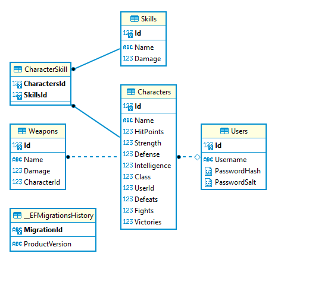
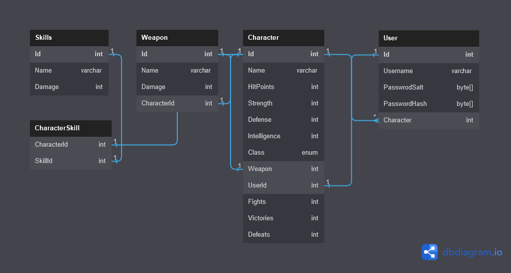

# Exercise to see what's new in dotnet 7
> this's an exercise so dont read much into it. . . 

## Run Locally:
1. clone it 
2. run a docker postgres container
    1. `docker container run -p 5432:5432 -e POSTGRES_PASSWORD=DiLb984ImW --name testgres postgres:latest` 
    1. i dont care about the pass as i dont use it anywhere xD
    1. docker-compose gave me problems so it was a no go . . .
3. open it in ur IDE of choice. i'd recommend Visual Studio over VSCode for dotnet.

### things that can be changed or implemented better
1. id, a GUID instead of an INT
1. auto migrations
1. defining the relations in model creating not leaving it to the designer, tho it did a nice job creating them!
2. bold of u to assume imma write them all !
### things i liked about it:
1. it creates many to many relations now . kool 

### things i didn't like:
1. u need to trust connection to a database, sure in a normal env but not while developing. . . 
1. implicit imports are nonesense ; change a folder name and good luck finding the using
1. using VSCode for dotnet is not as enjoyable of an experience as Visual Studio ; like why can't i pull up methods ??

### Database structre:

 

